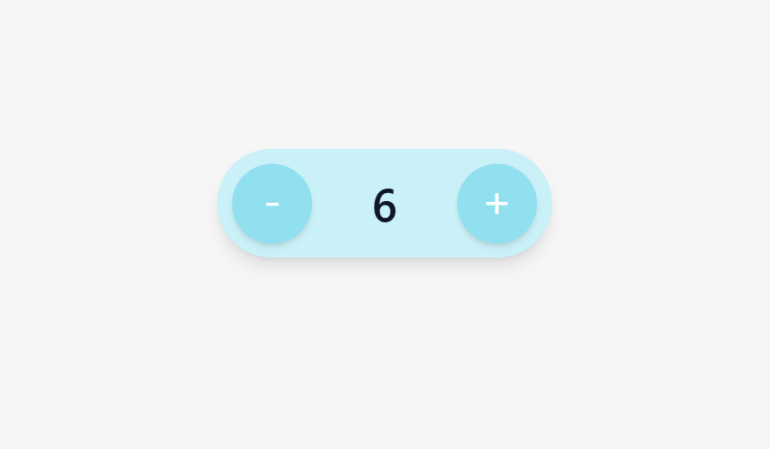

# Program Increment-Decrement nilai menggunakan button sebagai trigger

#### Alur dari program ini ialah, terdapat sebuah state yang menyimpan nilai awal, lalu nilai tersebut ditampilkan dan ketika salah satu tombol diklik maka akan dilakukan aksi tertentu terhadap nilai dari state tersbut. 

### 🚀 Tech Stacks :
- ReactJs ~19.2.6
- TailwindCSS ~4.3.0
- Vite ~8.0.12

### Preview Demo Button:
